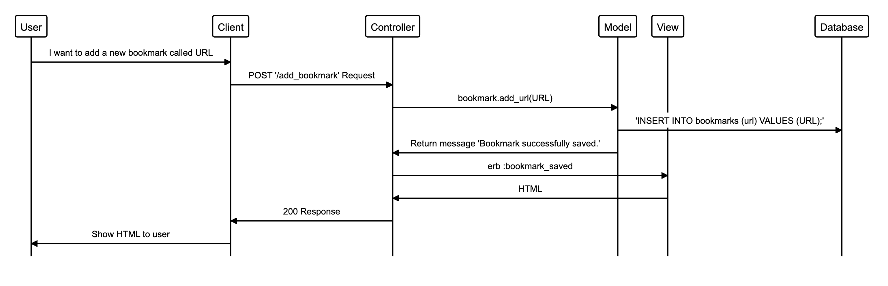

# Bookmark Manager

In collaboration with Margarida Martelo.

```
User Story 1:
As a user,
So that I can organise my favourite webpages,
I want to be able to see a list of my bookmarks
```


## Setting up the database:
1. Connect to psql
2. Create the database using the psql command CREATE DATABASE bookmark_manager;
3. Connect to the database using the pqsl command \c bookmark_manager;
4. Run the query we have saved in the file 01_create_bookmarks_table.sql


## Setting up the test database:
1. Connect to psql
2. Create the database using the psql command CREATE DATABASE bookmark_manager_test;
3. Connect to the database using the pqsl command \c bookmark_manager_test

```
User Story 2:
As a user
So I can store bookmark data for later retrieval
I want to add a bookmark to Bookmark Manager
```


